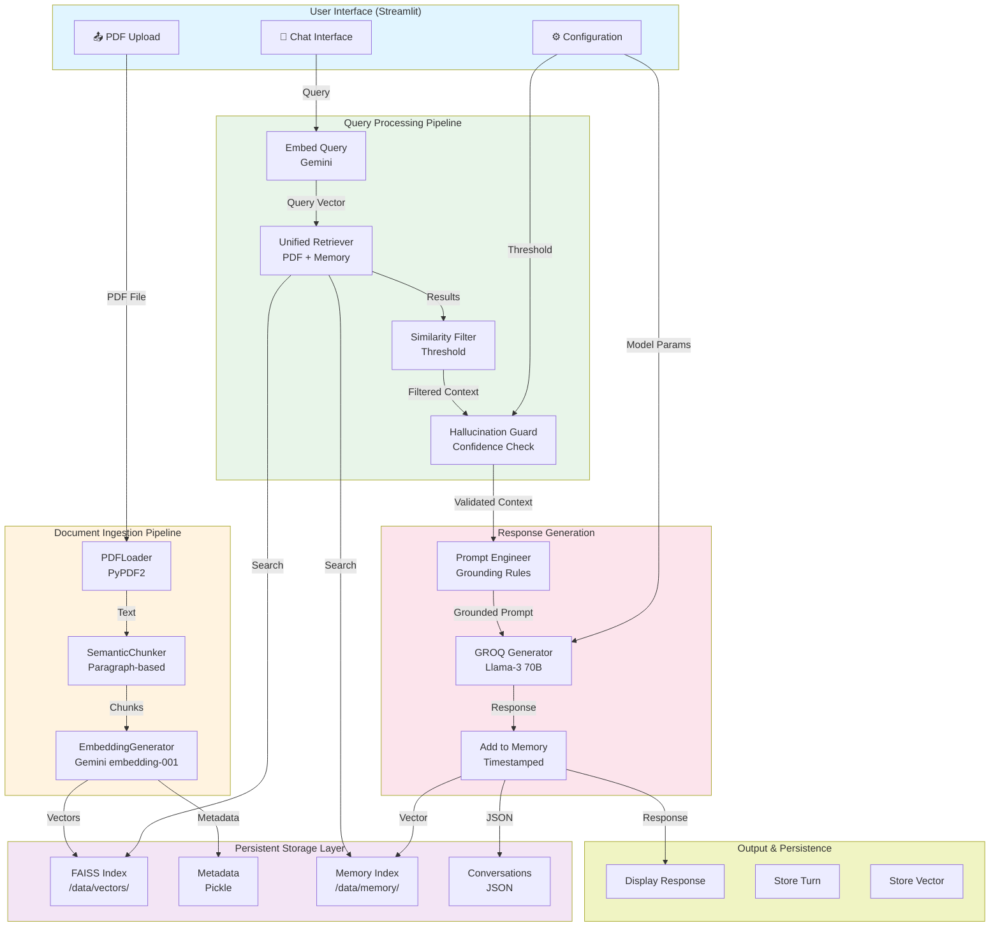
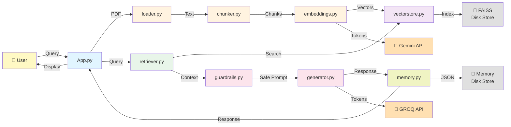
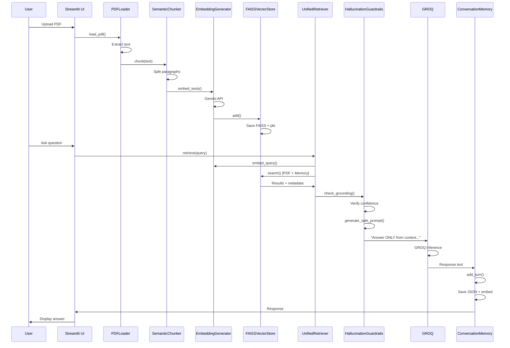
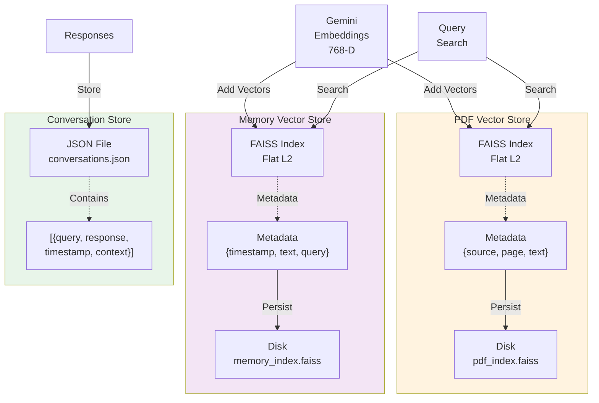
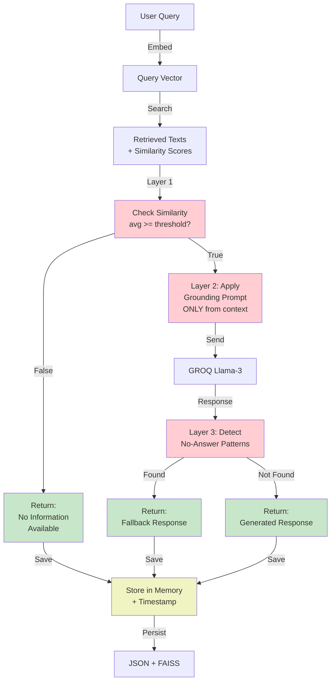

# Architecture Diagrams

## System Architecture (Mermaid)

## Component Interaction Diagram

## Data Flow - Document to Response

## Vector Store Architecture

## Hallucination Guardrails Pipeline

